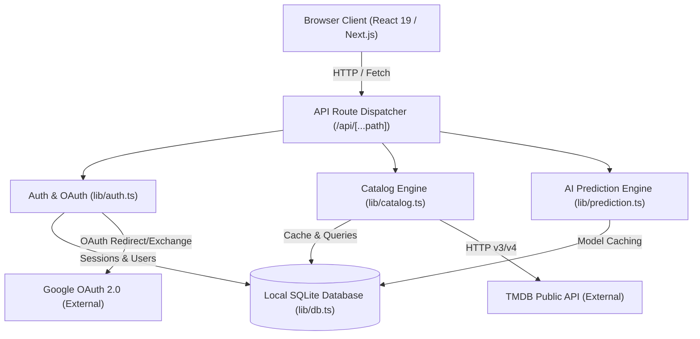

# CinePulse 🎬 — Cinema, Ahead of the Curve

> A fast, local-first cinematic discovery, tracking, and prediction platform. Combines community watchlists and diaries with TMDB data, streaming provider availability, cast filmographies, and an AI box-office prediction engine.

---

## 📌 Table of Contents
1. [Overview](#-overview)
2. [Key Features](#-key-features)
3. [Project Directory & File Structure](#-project-directory--file-structure)
4. [Architecture & Technology Stack](#-architecture--technology-stack)
5. [Database & Data Model](#-database--data-model)
6. [API Endpoints Reference](#-api-endpoints-reference)
7. [Getting Started & Installation](#-getting-started--installation)
8. [Configuration & Environment Variables](#-configuration--environment-variables)
9. [Google OAuth Setup Guide](#-google-oauth-setup-guide)
10. [Testing & Quality Assurance](#-testing--quality-assurance)

---

## 🌟 Overview

**CinePulse** is designed for cinema enthusiasts who want to track films, read/write community reviews, discover where titles are streaming, and forecast whether upcoming releases will be box-office hits or flops. 

Unlike traditional platforms that rely on heavy cloud database subscriptions, CinePulse is **local-first** and self-contained:
- Built with **Next.js (App Router)** and **React 19**.
- Backed by Node.js's native **`node:sqlite`** module (zero external database servers or native binary npm bindings needed).
- Fully integrated with the **The Movie Database (TMDB) API** for real past, present, and future movie & TV data.
- Includes a **built-in AI heuristic box-office prediction engine** with budget tiering, seasonality modeling, and community forecasting.
- Supports **Email/Password authentication** and **Google OAuth 2.0 Sign-In**.

---

## 🚀 Key Features

### 1. 🎞️ Real-Time TMDB Catalog & Discovery
- **Live Catalog**: Browse Trending, Upcoming Releases, Top Rated, and In Theaters titles.
- **TV & Movies**: Toggle seamlessly between feature films and television series.
- **Resilient Server-Side Fetching**: Automatic retry with exponential backoff, rate-limit handling, and SQLite-backed caching (`api_cache`) to minimize upstream API calls.

### 2. 📺 Where to Watch (OTT Streaming Providers)
- Integrated streaming availability powered by TMDB / JustWatch.
- Direct breakdowns for **Stream** (Netflix, Prime, Disney+, etc.), **Rent**, and **Buy** with official platform logos and links.

### 3. 🎯 Advanced Filters & Search
- **Instant Search**: Debounced search across movie and TV titles.
- **Granular Filtering**: Filter by genre, release year (1900–2100), minimum TMDB rating (e.g. 7.0+), and sorting metrics (Popularity, Top Rated, Newest).

### 4. 🎭 Person Profiles & Cast Filmography
- Interactive Cast & Crew cards on title detail modals.
- Clicking any actor or director opens an enriched **Person Profile modal** displaying their biography, birth details, profile picture, and comprehensive filmography with direct title links.

### 5. 🤖 AI Box-Office Prediction Engine
- Transparent heuristic algorithm (`lib/prediction.ts`) analyzing:
  - **Budget Tiers**: Mega ($180M+), Big ($90M+), Mid ($30M+), Low ($10M+), and Micro budgets.
  - **Genre Elasticity**: Calibrated multipliers (Sci-Fi/Action vs. Indie/Drama).
  - **Release Seasonality**: Blockbuster summer windows, holiday spikes, and dump months (Jan/Feb/Sep).
  - **Engagement Signals**: TMDB popularity momentum and pre-release sentiment.
- Computes projected worldwide revenue ranges, ROI multiples, and Hit/Flop confidence scores.

### 6. 📊 Community Forecasting Desk ("Opening Calls")
- Users cast their own forecast (**Hit** or **Flop**) with custom confidence levels and written rationale.
- Statistical consensus calculated using **Wilson score intervals** for reliable sample sizing.
- Forecasts permanently lock on release day to ensure honest historical tracking.

### 7. 📚 Personal Library & Diary
- Track titles across three statuses: **Want to Watch**, **Watching**, and **Watched**.
- Assign private 5-star ratings and personal notes.
- One-click **JSON Data Export** (`/api/export`) for full data portability.

### 8. 🔐 Authentication & Google Sign-In
- **Email + Password**: Secure, local credential auth using `scrypt` key derivation with individual salts.
- **Sign in / Sign up with Google**: Standard OAuth 2.0 flow with Google Cloud, plus an instant zero-config Demo Preview mode for development.
- **CSRF & Loopback Protection**: Intelligent origin enforcement supporting both `http://127.0.0.1:3000` and `http://localhost:3000`.

---

## 📂 Project Directory & File Structure

```text
cinepulse-v2/
├── app/                                 # Next.js App Router
│   ├── api/
│   │   └── [...path]/
│   │       └── route.ts                 # Unified REST API dispatcher & route handlers
│   ├── favicon.ico
│   ├── globals.css                      # Master design system (custom glassmorphism UI)
│   ├── layout.tsx                       # Root HTML shell & metadata
│   └── page.tsx                         # Client-side root page container
│
├── components/                          # Modular React 19 UI Components
│   ├── Account.tsx                      # Sign In / Sign Up modal (Email & Google Auth) & Profile
│   ├── Calendar.tsx                     # Theatrical & digital release calendar view
│   ├── client.ts                        # Type-safe client fetcher & date/currency helpers
│   ├── Community.tsx                    # Community reviews feed & user review modal
│   ├── Context.tsx                      # Global App state context (Auth, Library, Config, Toast)
│   ├── Discovery.tsx                    # Homepage hero, In Theaters banner, poster grids & filters
│   ├── Header.tsx                       # Top navigation bar, search input, and profile trigger
│   ├── Library.tsx                      # User library tabs (Watchlist, Watching, Watched)
│   ├── PersonDetail.tsx                 # Actor / Director biography & filmography modal
│   ├── PredictionDesk.tsx               # AI Prediction Engine cards & community sentiment
│   ├── TitleDetail.tsx                  # Full movie/show modal (Providers, Cast, Similar titles)
│   └── UI.tsx                           # Reusable UI primitives (Modal, StarPicker, ErrorBox, Logo)
│
├── lib/                                 # Core Server-Side Business Logic
│   ├── auth.ts                          # Password hashing, Google OAuth 2.0, session cookies, CSRF
│   ├── catalog.ts                       # TMDB API client, caching, health checks, mock demo data
│   ├── db.ts                            # Node.js SQLite (DatabaseSync) connection & migrations
│   ├── eligibility.ts                   # Date math & release date validation
│   ├── errors.ts                        # HttpError classes (bad, unauthorized, forbidden, conflict)
│   ├── library.ts                       # User library operations (CRUD)
│   ├── math.ts                          # Wilson score confidence intervals & statistical math
│   ├── prediction.ts                    # AI Box-Office Prediction Engine heuristic algorithms
│   ├── pulse.ts                         # Community forecasting consensus & history aggregations
│   ├── reviews.ts                       # Community reviews & spoiler flagging
│   └── types.ts                         # TypeScript interfaces (Title, User, Review, Forecast, etc.)
│
├── tests/                               # Comprehensive Automated Test Suites
│   ├── auth-google.test.ts              # Origin loopback validation & Google auth tests
│   ├── backend-regressions.test.ts      # Authentication & validation regression checks
│   ├── catalog.test.ts                  # Catalog fetching, caching & pagination tests
│   ├── catalog-resilience.test.ts       # Retry delays, error recovery & TMDB health checks
│   ├── client.test.ts                   # Client HTTP fetch resilience tests
│   ├── library-matrix.test.ts           # Media status & release date matrix tests
│   ├── math.test.ts                     # Wilson interval mathematical proofs
│   ├── migrations.test.ts               # SQLite schema upgrade and data preservation tests
│   └── storage.test.ts                  # SQLite cache eviction & cleanup tests
│
├── data/                                # Local SQLite Storage (auto-created)
│   └── cinepulse.db                     # SQLite database file
│
├── scripts/                             # Utility & integration scripts
│   ├── check-tmdb.mjs                   # Diagnostic script to test TMDB token connectivity
│   └── integration.mjs                  # Integration test harness
│
├── .env.example                         # Template environment variables
├── .env.local                           # Local environment config (credentials, TMDB token)
├── next.config.ts                       # Next.js build configuration
├── package.json                         # Dependencies and npm scripts
├── tsconfig.json                        # TypeScript configuration
└── README.md                            # Project documentation
```

---

## 🏛️ Architecture & Technology Stack



| Layer | Technology | Details |
| :--- | :--- | :--- |
| **Framework** | Next.js 16 (App Router) | Server-rendered shells, React 19 client components, dynamic route dispatchers |
| **Styling** | Vanilla CSS (Zero Runtime) | Custom CSS tokens, glassmorphism, responsive grid, dark mode |
| **Database** | Node.js `DatabaseSync` | Native `node:sqlite` introduced in Node.js 22; zero native build tools or C++ compilation |
| **Icons** | Lucide React | Lightweight SVG iconography |
| **Authentication** | Custom Session + Google OAuth | Cryptographically random base64url tokens, `scrypt` password hashing, Google OAuth 2.0 |
| **Data Provider** | The Movie Database (TMDB) | Public API v3/v4 with server-side API cache to avoid rate limits |

---

## 🗄️ Database & Data Model

The application uses an embedded SQLite database (`data/cinepulse.db`). Schema migrations are automated sequentially in `lib/db.ts`:

- **`users`**: User identities (`id`, `name`, `email`, `password_hash`, `created_at`).
- **`sessions`**: Active authentication sessions (`token_hash`, `user_id`, `expires_at`, `created_at`).
- **`library`**: User lists and ratings (`user_id`, `title_id`, `title_json`, `status`, `rating`, `updated_at`).
- **`reviews`**: Community title reviews (`id`, `user_id`, `title_id`, `title_name`, `body`, `rating`, `spoiler`, `kind`, `created_at`).
- **`forecasts`**: Active user predictions on titles (`user_id`, `title_id`, `choice`, `confidence`, `reason`, `updated_at`).
- **`forecast_events`**: Append-only log of forecast submissions (`id`, `user_id`, `title_id`, `choice`, `confidence`, `release_date`).
- **`api_cache`**: TTL-based cache for external TMDB API responses (`cache_key`, `value`, `expires_at`).
- **`prediction_cache`**: Cached outputs of AI prediction calculations (`title_id`, `model_version`, `result_json`, `expires_at`).

---

## 🔌 API Endpoints Reference

All API routes are served under `/api/...`:

| Method | Endpoint | Description |
| :--- | :--- | :--- |
| `GET` | `/api/config` | Returns catalog mode (`tmdb` or `demo`), active region, and health status |
| `GET` | `/api/catalog` | Queries titles with pagination, media filter, collection, genre, year, rating |
| `GET` | `/api/title/:id` | Returns full metadata for a specific movie or series |
| `GET` | `/api/providers/:id` | Returns streaming, rental, and purchase providers (JustWatch) |
| `GET` | `/api/similar/:id` | Returns titles similar to the specified title |
| `GET` | `/api/recommended/:id` | Returns TMDB algorithmic recommendations |
| `GET` | `/api/person/:id` | Returns person biography, profile image, and filmography credits |
| `GET` | `/api/prediction/:id` | Computes or retrieves AI box-office predictions for a film |
| `GET` | `/api/pulse/:id` | Returns aggregated community forecast statistics (Wilson interval) |
| `POST` | `/api/pulse/:id` | Submits or updates the current user's forecast for a title |
| `GET` | `/api/auth/me` | Returns the currently authenticated user profile |
| `POST` | `/api/auth/register` | Creates a new account with email and password |
| `POST` | `/api/auth/login` | Authenticates with email and password, setting session cookie |
| `POST` | `/api/auth/logout` | Revokes the current session and clears the session cookie |
| `GET` | `/api/auth/google` | Initiates Google OAuth redirect or dev demo authentication |
| `GET` | `/api/auth/google/callback` | Google OAuth callback handler; validates code, registers/logs in user |
| `POST` | `/api/auth/google/demo` | Instant 1-click Google authentication preview for development |
| `GET` | `/api/library` | Retrieves all library entries for the authenticated user |
| `PUT` | `/api/library/:id` | Adds or updates a title in the user's library (watchlist/watched/rating) |
| `DELETE` | `/api/library/:id` | Removes a title from the user's library |
| `GET` | `/api/community` | Retrieves recent reviews from across the community |
| `POST` | `/api/reviews/:id` | Posts a new review for a title |
| `DELETE` | `/api/reviews/:id` | Deletes the authenticated user's review for a title |
| `GET` | `/api/export` | Downloads full user profile, library, reviews, and forecasts as JSON |
| `DELETE` | `/api/account` | Permanently deletes account and all associated records |

---

## ⚡ Getting Started & Installation

### Prerequisites
- **Node.js 22.13.0 or higher** (Required for native `node:sqlite`).
- **npm** (comes bundled with Node.js).

### Setup Instructions

1. **Clone the repository:**
   ```bash
   git clone https://github.com/ronitparmar24/Cinepulse.git
   cd Cinepulse/cinepulse-v2
   ```

2. **Install dependencies:**
   ```bash
   npm install
   ```

3. **Configure Environment:**
   Create a `.env.local` file in the root of `cinepulse-v2/`:
   ```env
   CATALOG_MODE=tmdb
   TMDB_READ_TOKEN=your_tmdb_api_read_token
   TMDB_REGION=US
   APP_ORIGIN=http://127.0.0.1:3000
   ```

4. **Start the Development Server:**
   ```bash
   npm run dev
   ```

5. **Open in Browser:**
   Navigate to [http://127.0.0.1:3000](http://127.0.0.1:3000).

---

## ⚙️ Configuration & Environment Variables

Create `.env.local` in `cinepulse-v2/` to customize behavior:

| Variable | Required | Default | Description |
| :--- | :---: | :---: | :--- |
| `CATALOG_MODE` | No | `demo` | Set to `tmdb` to fetch real movies, or `demo` for offline fictional catalog |
| `TMDB_READ_TOKEN` | Yes (if tmdb) | — | TMDB API v3/v4 Read Access Token (from [themoviedb.org](https://www.themoviedb.org/settings/api)) |
| `TMDB_REGION` | No | `US` | Primary region code for theatrical releases and streaming availability (e.g. `US`, `GB`, `IN`) |
| `APP_ORIGIN` | No | Request URL | Explicit origin URL for CSRF validation (e.g. `http://127.0.0.1:3000`) |
| `GOOGLE_CLIENT_ID` | Optional | — | Google Cloud OAuth 2.0 Client ID for live Google Sign-In |
| `GOOGLE_CLIENT_SECRET` | Optional | — | Google Cloud OAuth 2.0 Client Secret |
| `DATABASE_PATH` | No | `./data/cinepulse.db` | Custom path to the local SQLite database file |

---

## 🔑 Google OAuth Setup Guide

CinePulse includes complete support for **Sign in with Google** / **Sign up with Google**:

### 1. Instant Dev Preview (No Setup Required)
If you click **Sign in with Google** or **Sign up with Google** while `GOOGLE_CLIENT_ID` is not configured, CinePulse displays a friendly helper card that allows 1-click preview authentication (e.g. with `ronit@gmail.com`). This lets you test Google-linked accounts immediately!

### 2. Enabling Live Google Cloud OAuth
To connect your live Google account:
1. Go to the [Google Cloud Console](https://console.cloud.google.com/).
2. Create a project and navigate to **APIs & Services > Credentials**.
3. Click **Create Credentials > OAuth client ID**.
4. Select Application type: **Web application**.
5. Under **Authorized JavaScript origins**, add:
   - `http://localhost:3000`
   - `http://127.0.0.1:3000`
6. Under **Authorized redirect URIs**, add:
   - `http://localhost:3000/api/auth/google/callback`
   - `http://127.0.0.1:3000/api/auth/google/callback`
7. Copy your Client ID and Client Secret into `.env.local`:
   ```env
   GOOGLE_CLIENT_ID=your-client-id.apps.googleusercontent.com
   GOOGLE_CLIENT_SECRET=your-client-secret
   ```
8. Restart your dev server (`npm run dev`). Live Google Sign-in is now active!

---

## 🧪 Testing & Quality Assurance

The codebase includes an extensive suite of unit, integration, resilience, and migration tests:

```bash
# Run the complete test suite
npm test

# Type-check TypeScript across the entire project
npx tsc --noEmit

# Run targeted authentication tests
npx tsx --test tests/auth-google.test.ts

# Test TMDB token reachability directly
node scripts/check-tmdb.mjs
```

---

## 📄 License

This project is created for educational and portfolio demonstration purposes. All film posters, backdrops, and metadata are provided by [The Movie Database (TMDB)](https://www.themoviedb.org/) and belong to their respective copyright owners.
